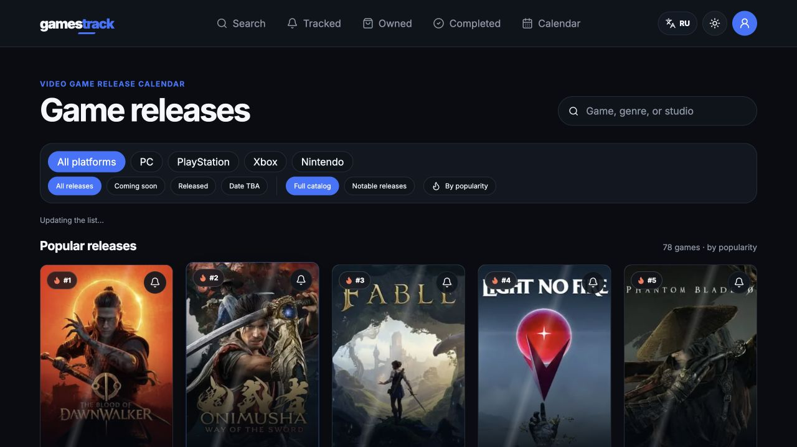
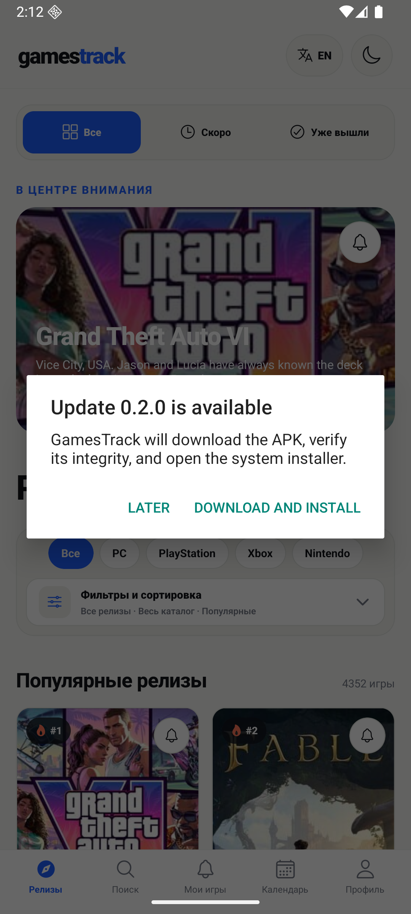
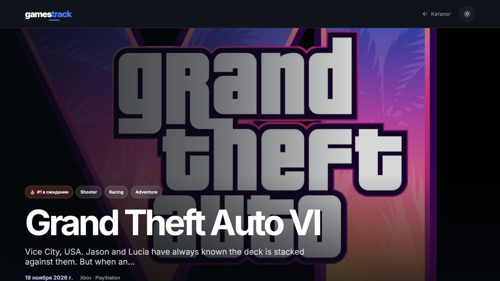

  <a href="README.md">Русский</a> · <b>English</b>

  

<h1 align="center">GamesTrack</h1>

  A clean video game release calendar and personal tracker for Android and the web.

  <a href="https://gamestrack.top"><b>Open the website</b></a>
  &nbsp;·&nbsp;
  <a href="https://github.com/svllvsxprod/gamestrack-releases/releases/latest"><b>Download APK</b></a>
  &nbsp;·&nbsp;
  <a href="#installation"><b>Installation</b></a>

<table align="center">
  <tr>
    <td align="center" width="760">
      <h3>Support development</h3>
      
Your support helps cover hosting, data sources, and future GamesTrack releases.

      <table align="center">
        <tr>
          <td align="center" width="350"></td>
          <td align="center" width="350"></td>
        </tr>
        <tr>
          <td align="center" colspan="2"></td>
        </tr>
      </table>
    </td>
  </tr>
</table>

  
  
  
  

  <a href="#features">Features</a> ·
  <a href="#interface">Interface</a> ·
  <a href="#installation">Installation</a> ·
  <a href="#data-and-privacy">Privacy</a>

## About

GamesTrack brings video game releases into a single catalog and lets you follow the exact edition you care about: release dates for PC, PlayStation, Xbox, and Nintendo may differ. Build a personal calendar, receive reminders, mark owned and completed games, add personal ratings, and export your collection.

The website and Android app can use the same account. Both Russian and English interfaces are available, along with light and dark themes.

## Features

- A large catalog of upcoming and released games with covers, screenshots, and trailers.
- Independent release dates and reminders for PC, PlayStation, Xbox, and Nintendo.
- Search, platform filters, and sorting by popularity, date, or rating.
- A personal calendar for tracked releases.
- Owned and Completed libraries with personal ratings from 1 to 10.
- TXT export and polished PDF export with cover art.
- Shareable personal ranking of completed games.
- Price and pre-order information when store data is available.
- Russian and English localization, plus light and dark themes.
- A web app and a native Android build.
- Backend-independent Android updates from GitHub Releases with SHA-256 verification.

## Interface

### Web catalog

  

### Android — catalog and themes

<table align="center">
  <tr>
    <td align="center"></td>
    <td align="center"></td>
    <td align="center"></td>
  </tr>
  <tr>
    <td align="center">Light theme</td>
    <td align="center">Dark theme</td>
    <td align="center">Compact filters</td>
  </tr>
</table>

### Android — tracking and collection

<table align="center">
  <tr>
    <td align="center"></td>
    <td align="center"></td>
    <td align="center"></td>
  </tr>
  <tr>
    <td align="center">Platform reminders</td>
    <td align="center">My Games</td>
    <td align="center">Personal calendar</td>
  </tr>
</table>

### Android — game details, gallery, and export

<table align="center">
  <tr>
    <td align="center"></td>
    <td align="center"></td>
    <td align="center"></td>
  </tr>
  <tr>
    <td align="center">Game details</td>
    <td align="center">Trailer and gallery</td>
    <td align="center">PDF, TXT, and public ranking</td>
  </tr>
</table>

### Independent Android updates

<table align="center">
  <tr>
    <td align="center"></td>
    <td align="center"></td>
    <td align="center"></td>
  </tr>
  <tr>
    <td align="center">Manual update check</td>
    <td align="center">Fresh APK download</td>
    <td align="center">Full-screen viewer</td>
  </tr>
</table>

### Game details

  

## Installation

1. Open the [latest release](https://github.com/svllvsxprod/gamestrack-releases/releases/latest).
2. Download `GamesTrack-0.2.1.apk`.
3. Open the APK on your Android device and approve installation from the selected source.
4. Allow notifications on first launch if you want release reminders.

Android 7.0 or newer is required. Google Play distribution will be added later. The web version is always available at [gamestrack.top](https://gamestrack.top).

Starting with version 0.2.1, the app checks this repository directly once a day and offers to download a newer APK when available. The APK is verified against its published SHA-256 checksum before the system installer opens. You can also run the check manually from Profile. Android always requires final installation confirmation, and the first update requires allowing installs from GamesTrack.

## Data and privacy

- Authentication is provided by Clerk; GamesTrack does not store user passwords.
- You can export or delete your data from the profile page.
- Reminders are platform-specific and can be disabled at any time.
- Read the [Privacy Policy](https://gamestrack.top/privacy).
- Terms of Use: [gamestrack.top/terms](https://gamestrack.top/terms).

## About this repository

This public repository contains release builds, release notes, and screenshots only. GamesTrack source code is not published here.

Found a bug or have a feature request? Open an [Issue](https://github.com/svllvsxprod/gamestrack-releases/issues) or contact us on [Telegram](https://t.me/svllvsxprod).
